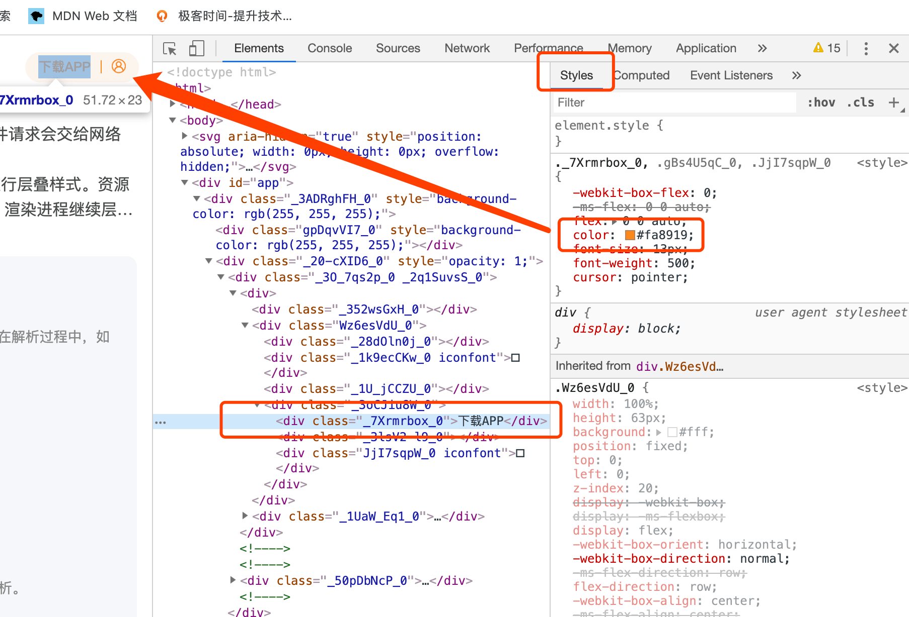
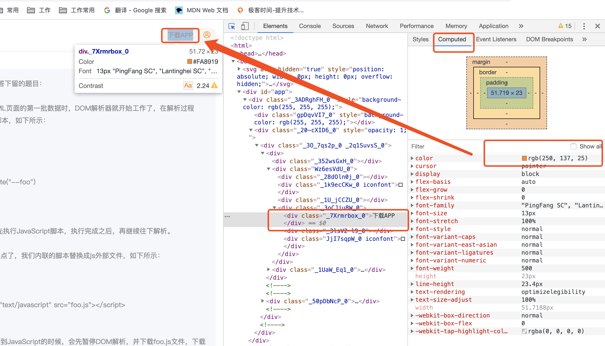

# 大部分 `web` 都是跑在浏览器环境中的
也有小部分前端，是跑在其他环境中的。很久以前一直想要了解浏览器是什么东西，看过很多文章，时效性都不行，好的文章我的英语把我拒之千里。所以我要好好学习英语。明天开始

## 浏览器是如何渲染网页的？
关于这个问题我想了很久，看了网上的很多文章，到如今我才有一个比较清晰的概念。如果你也想了解，推荐你看一系列文章 [浏览器工作原理与实践](https://time.geekbang.org/column/article/118205) ，目前我就基于这个写自己的理解。

网页三剑客（`html css javascript`)我就不多说了。如果把浏览器渲染比作一条流水线的话，前三步不用多说基本上大家都知道
> 1. `DOM` 生成 （这个细说能说很多，`AST` ，数据结构....)

> 2. 样式计算 

首先把 `css` 理解成浏览器能够理解的结构 `styleSheets`。转换样式表中的属性，使其标准化，这里可以涉及到性能优化，平时写代码的时候尽量标准化，可以加快浏览器渲染。举个例子：`vw`,`color:blue` 都会转化为渲染引擎容易理解的 `px`,`color:rgb(0,0,255)`。所以是不是我们可以在标准化这里注意代码书写，提高渲染速度呢？？

最后就是计算每一个 `DOM` 树中每一个节点的具体样式了。

> 3. 布局

完成之后并不是直接渲染到页面，并不是，只是把这些信息保存在布局树中，接下来是进行分层

> 4. 分层，你没有听错？

因为在页面中有很多复杂的效果，3D转换，页面滚动，z-index等等，提高了页面的层级，为了更加方便的实现这些效果，渲染引擎还需要为特定的节点生成专用图层，并生成一颗对应的图层树（如果你用过ps，就很好理解图层，分层了，拥有层叠上下文，被剪裁一般都会分层）

> 5. 图层绘制

> 6. 栅格化操作

后面两个后面在慢慢解释（快点补充

所以浏览器渲染网页的整个流程是