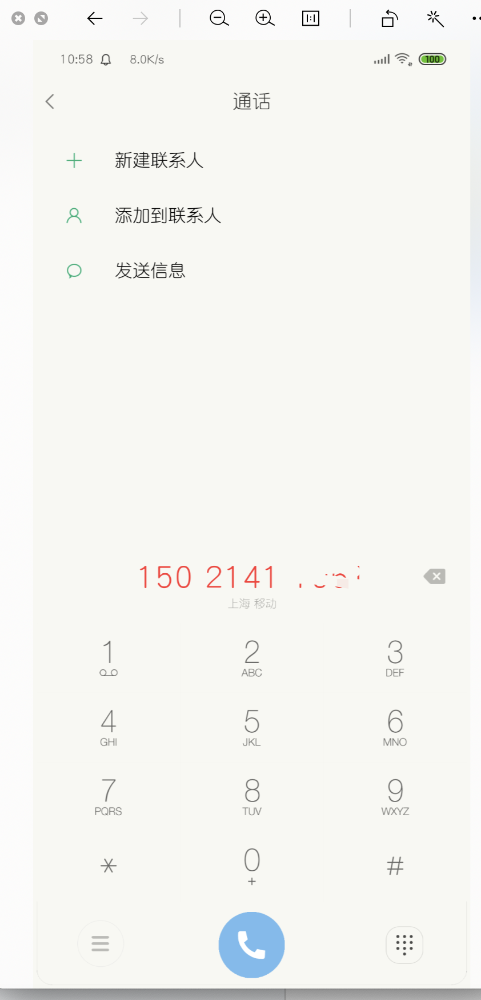

# 最近一直在写移动端，以前的复制粘贴，现在的手写

等以后写多了，我想有经验了，应该也是复制粘贴吧，很多东西不到手机上，不进行手机兼容性测试，发现不了问题。记录兼容性，手机端问题

## `IOS` 兼容系列问题
> 1. `IOS` 滚动不顺畅，卡顿，安卓手机没有任何问题

`-webkit-overflow-scrolling: touch;`;  [MDN](https://developer.mozilla.org/zh-CN/docs/Web/CSS/-webkit-overflow-scrolling) 的解释 `-webkit-overflow-scrolling` 属性控制元素在移动设备上是否使用滚动回弹效果. `touch` 使用具有回弹效果的滚动, 当手指从触摸屏上移开，内容会继续保持一段时间的滚动效果。继续滚动的速度和持续的时间和滚动手势的强烈程度成正比。同时也会创建一个新的堆栈上下文。

> 2. 调用 `focus()` 进行聚焦，弹起手机原生软键盘，同一段代码在安卓里面没问题，`IOS` 始终键盘没有唤起 ？

在 `<input autofocus v-model="value" ref='inputRef' @click.stop='showPopUp' />` 加上 `autofocus` 页面加载的时候获取焦点

> 3. 移动端监听事件没法唤起软键盘，

解决关键: 用户触发，要不是直接点击文本输入元素，要不就是间接点击。参考文章
[移动端 JavaScript 拉起软键盘](http://www.iamaddy.net/2016/11/mobile-keyboard-javascript/)

## 移动端需求


> 2. 点击页面的电话号码，调起手机里面拨号版，并且把电话号码复制到拨号板



最开始的时候以为很难，需要调用原生 `app` 那边的 `api` 后来我发现，是我想多了，`javascript` 原生的方法就可以实现，而且很简单，利用 `a` 标签的 `href` 属性

```
    <!-- 控制它的显隐，弹框确定后，可点击，就跳到打电话页面了 :href="'tel:'+tel" 必须这样写 -->
    <a  :href="'tel:'+tel"></a>
```

注意了：如果 `href` 是一个变量值，必须那样写，常量的话就 `<a href="'tel:12306"></a>`

> 3. 以前在移动端遇到过，离开了输入框，但是键盘还没有收起，这个交互有点不太好，导致每次操作都变的很繁琐，（点击非输入框的键盘收起事件）

```
document.addEventListener('touchend', e => {
  if (['INPUT', 'TEXTAREA'].indexOf(e.target.nodeName) < 0) {
    let inputArr = document.getElementsByTagName('input')
    let textareaArr = document.getElementsByTagName('textarea')
    if (inputArr.length) {
      for (let i = 0; i < inputArr.length; i++) {
        inputArr[i].blur()
      }
    }
    if (textareaArr.length) {
      for (let j = 0; j < textareaArr.length; j++) {
        textareaArr[j].blur()
      }
    }
  }
}, false)
```

> 4. 在移动端页面有 `input` 或者 `textarea` 标签的时候，会调起键盘，这个是没有问题的。但是在手离开这些标签之后，键盘依旧没有收起，这是一个问题，影响了用户的体验。 后来发现在页面创建的时候就监听 `touchend` 事件可以避免这个。当手指从屏幕上离开的时候触发失焦事件，请测有用

```
    document.addEventListener(
      'touchend',
      e => {
        if (['INPUT', 'TEXTAREA'].indexOf(e.target.nodeName) < 0) {
          let inputArr = document.getElementsByTagName('input')
          let textareaArr = document.getElementsByTagName('textarea')
          if (inputArr.length) {
            for (let i = 0; i < inputArr.length; i++) {
              inputArr[i].blur()
            }
          }
          if (textareaArr.length) {
            for (let j = 0; j < textareaArr.length; j++) {
              textareaArr[j].blur()
            }
          }
        }
      },
      false
    )
```

> 5. 在移动端项目用到了单击 `click` 事件的时候 `scrollTo` 滚动一定的距离。大部分的情况下是没有问题，但是对于某些安卓机型，`scrollTo` 会失效。这就头疼了，解决方案 `scrollLeft` 

[Window.scrollTo()](https://developer.mozilla.org/zh-CN/docs/Web/API/Window/scrollTo)

[开发移动端web页面click事件失效问题](https://www.cnblogs.com/exhuasted/p/6857289.html)

[安卓浏览器不支持JS中的scrollto()等滑动方法](https://www.oschina.net/question/869542_79568)

 ```
<!-- 拨号 -->
<a href="tel:10086">打电话给: 10086</a>

<!-- 关闭电话号码识别 -->
<meta name="format-detection" content="telephone=no">

<!-- 发送短信 -->
<a href="sms:10086">发短信给: 10086</a>

<!-- 发送邮件 -->
<a href="mailto:839626987@qq.com">发邮件给：839626987@qq.com</a>

<!-- 关闭邮箱识别 -->
<meta name="format-detection" content="email=no">

<!-- 选择照片或者拍摄照片 -->
<input type="file" accept="image/*">

<!-- 选择视频或者拍摄视频 -->
<input type="file" accept="video/*">

<!-- 多选 -->
<input type="file" multiple>

<!-- 忽略浏览器自动识别数字为电话号码 -->
<meta name="format-detection" content="telephone=no"> 
 
<!-- 忽略浏览器自动识别邮箱账号 --> 
<meta name="format-detection" content="email=no">


<a href="weixin://">打开微信</a>

<a href="alipays://">打开支付宝</a>

<a href="alipays://platformapi/startapp?saId=10000007">打开支付宝的扫一扫功能</a>

<a href="alipays://platformapi/startapp?appId=60000002">打开支付宝的蚂蚁森林</a>

```

 清除 `ios` 上输入框默认有内部阴影: `-webkit-appearance: none`

`android` 系统中元素被点击时产生边框: `-webkit-tap-hightlight-color:rgba(0,0,0,0);-webit-user-modify:read-write-plaintext-only;`

## rem px em
rem官方定义『The font size of the root element』，即根元素的字体大小。rem是一个相对的CSS单位，1rem等于html元素上font-size的大小。所以，我们只要设置html上font-size的大小，就可以改变1rem所代表的大小

px 相对于显示器屏幕分辨率，无法用浏览器字体放大功能

em 值不是固定的，会继承父级的字体大小：em = 像素值/父级 font-size

[总结移动端H5开发常用技巧（干货满满哦！）](https://juejin.im/post/5e4a0162f265da57133b2005)