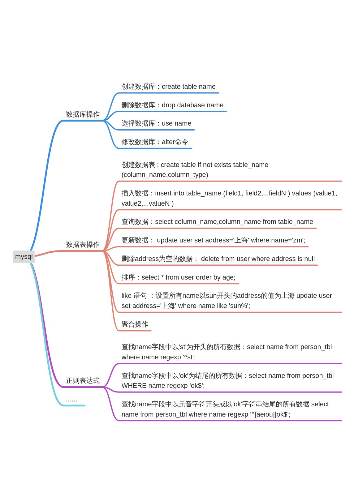

# mysql

[https://zhimap.com/medit/5ba6922b4aee4647892f19a601a23647](https://zhimap.com/medit/5ba6922b4aee4647892f19a601a23647)

​

### 数据库操作

1. 创建数据库：create table name
2. 删除数据库：​drop database name
3. ​选择数据库：use name
4. 修改数据库：alter命令
    1. 往user表里面添加的 address 字段： alter table user add `address` varchar(10) ;
        1. address 字段会自动添加到数据表字段的末尾。
        2. 新增字短位第一列： alter table user add `address` varchar(10) first;
        1. 新增字短位第一列某个字段之后,默认值是‘dev’：alter table user add `role` varchar(10) default 'dev' after name;
    1. 在user表里删除创建表的 address 字段不能删除最后一个字段： alter table user drop  address;
    2. 把字段 c 的类型从 char(1) 改为 char(10)：alter table user modify c char(10);
    3. 修改的字段名，然后指定新字段名及类型：alter table user change c lick varchar(10) ;
    4. 指定字段的默认值：alter table user modify `address` varchar(10) default '上海';
    5. 修改字段的默认值: alter table user alter `address` set default '湖南' ; 
    6. 删除字段的默认值， alter table user alter address drop default;
    7. 修改表的名字：alter table user rename to ser;
### 数据表的操作

1. 创建数据表 : create table if not exists table_name (column_name,column_type)
```plain
create table if not exists  `runoob_tbl`(
   `runoob_id` INT UNSIGNED AUTO_INCREMENT,
   `runoob_title` VARCHAR(100) NOT NULL,
   `runoob_author` VARCHAR(40) NOT NULL,
   `submission_date` DATE,
   PRIMARY KEY ( `runoob_id` )
)ENGINE=InnoDB DEFAULT CHARSET=utf8;
```
    1. ​AUTO_INCREMENT定义列为自增的属性，一般用于主键，数值会自动加1
    2. ​PRIMARY KEY关键字用于定义列为主键。 您可以使用多列来定义主键，列间以逗号分隔。
    3. ENGINE 设置存储引擎，CHARSET 设置编码。
    4. ​如果你不想字段为 NULL 可以设置字段的属性为 NOT NULL， 在操作数据库时如果输入该字段的数据为NULL ，就会报错。
 

2. 插入数据：insert into table_name (field1, field2,...fieldN ) values (value1, value2,...valueN )
3. ​查询数据：select column_name,column_name from table_name
    1. 查询语句中你可以使用一个或者多个表，表之间使用逗号(,)分割，并使用WHERE语句来设定查询条件。
    2. select 命令可以读取一条或者多条记录。
    3. 可以使用星号（*）来代替其他字段，select语句会返回表的所有字段数据
    4. ​可以使用 where 语句来包含任何条件,and 或者 or 指定一个或多个条件,类似程序语言中的 if 条件。
    5. 可以使用 LIMIT 属性来设定返回的记录数。
    6. 可以通过OFFSET指定SELECT语句开始查询的数据偏移量。默认情况下偏移量为0。
4. 更新数据： update user set address='上海' where name='zm';
    1. 可以同时更新一个或多个字段。
    2. WHERE 子句中指定任何条件。
    3. 在一个单独表中同时更新数据。
5. 删除address为空的数据： delete from user where address is null
    1. ​如果没有指定 WHERE 子句，MySQL 表中的所有记录将被删除。
    2. 你可以在 WHERE 子句中指定任何条件
    3. 您可以在单个表中一次性删除记录。
6. like 语句 ：设置所有name以sun开头的address的值为上海 update user set address='上海' where name like 'sun%';
    1. 可以在 WHERE 子句中使用LIKE子句。
    2. 可以使用LIKE子句代替等号 =。
    3. ​LIKE 通常与 % 一同使用，类似于一个元字符的搜索。
    4. 可以使用 AND 或者 OR 指定一个或多个条件。
    5. 可以在 DELETE 或 UPDATE 命令中使用 WHERE...LIKE 子句来指定条件。
7. 聚合操作：
```plain
select expression1, expression2, ... expression_n
from tables
[where conditions]
union [all | distinct ]
select expression1, expression2, ... expression_n
from tables
[where conditions];
```
    1.  MySQL UNION 操作符用于连接两个以上的 SELECT 语句的结果组合到一个结果集合中。多个 SELECT 语句会删除重复的数据。
    2. expression1, expression2, ... expression_n: 要检索的列。
    3. ​WHERE conditions: 可选， 检索条件。
    4. ​DISTINCT: 可选，删除结果集中重复的数据。默认情况下 UNION 操作符已经删除了重复数据，所以 DISTINCT 修饰符对结果没啥影响。
    5. ​ALL: 可选，返回所有结果集，包含重复数据。
8. 排序：select * from user order by age;
    1. 可以使用任何字段来作为排序的条件，从而返回排序后的查询结果。
    2. 你可以设定多个字段来排序。
    3. 可以使用 ASC 或 DESC 关键字来设置查询结果是按升序或降序排列。 默认情况下，它是按升序排列。
    4. ​你可以添加 WHERE...LIKE 子句来设置条件。
### 连接方式

用两个表（a_table、b_table），关联字段a_table.a_id和b_table.b_id来演示一下MySQL的内连接、外连接（ 左(外)连接、右(外)连接、全(外)连接）

1. 内连接：select * from a_table a inner join b_table b on a.a_id = b.b_id;组合两个表中的记录，返回关联字段相符的记录，也就是返回两个表的交集（阴影）部分。


2. 左连接：select * from a_table a left join b_table b on a.a_id = b.b_id;左表(a_table)的记录将会全部表示出来，而右表(b_table)只会显示符合搜索条件的记录。右表记录不足的地方均为NULL。


3. 右连接：select * from a_table a  right  join b_table b  on a.a_id = b.b_id;左表(a_table)只会显示符合搜索条件的记录，而右表(b_table)的记录将会全部表示出来。左表记录不足的地方均为NULL。


### 正则表达式

1. 查找name字段中以'st'为开头的所有数据：select name from person_tbl where name regexp '^st';
2. 查找name字段中以'ok'为结尾的所有数据：select name from person_tbl WHERE name regexp 'ok$';
3. 查找name字段中以元音字符开头或以'ok'字符串结尾的所有数据​ select name from person_tbl where name regexp '^[aeiou]|ok$';
