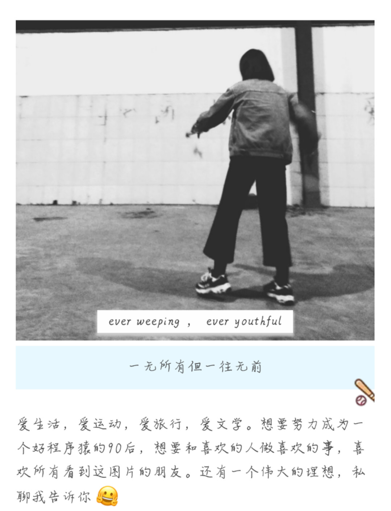

[我的简历]({{ site.url }}/images/life/1.pdf)

借用微信公众号三年前的一张图

那时候我还是个学生，那时候的我和现在的我，同个我的不同时期。

有事没事喜欢瞎写公众号，有兴趣可以粉一波：sunseekers

前行的生活路上仍然可以做自己，不迷失，不管走多远都能记得当初的梦想

真的勇士敢于直面惨淡的人生，是简单还是不易，都要快乐

古人云：" 二十弱冠,三十而立,四十为惑.五十而知天命,六十花甲,七十古来稀,八十耄耋"；

不同时期有不同的故事，从未停止一直在继续故事和时间，有故事也有酒

愿你走出半生， 归来仍是少年

但愿所期望的远方，都会如期而至

